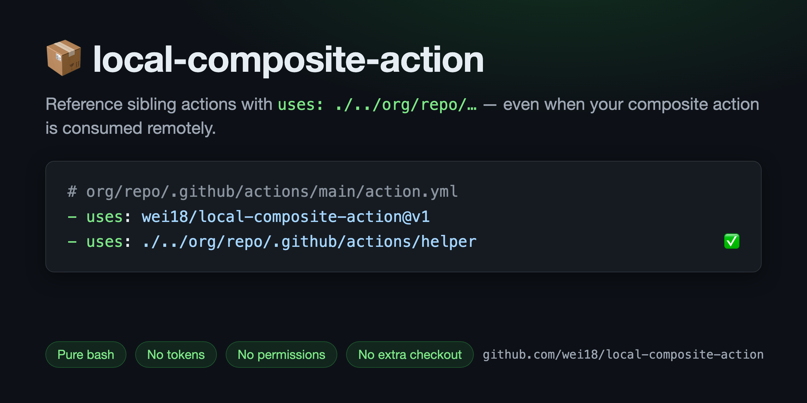

<!-- KEEP IN SYNC: any change to this file must be mirrored in README.zh-TW.md (see CLAUDE.md) -->
# 📦 local-composite-action

**English** | [繁體中文](README.zh-TW.md)

[](https://github.com/wei18/local-composite-action/actions/workflows/test.yml)
[](https://github.com/wei18/local-composite-action/releases/latest)
[](https://github.com/marketplace/actions/setup-symlink-for-action-repository)
[](LICENSE)



Reference sibling actions in your own repository with `uses: ./../org/repo/...` —
even when your composite action is consumed remotely.
Pure bash, no extra checkout, no tokens, no permissions.

## 😖 The problem

Your repository ships a composite action that calls another local action in the same repo:

```yaml
# org/repo/.github/actions/main/action.yml
runs:
  using: 'composite'
  steps:
    - uses: ./.github/actions/helper   # ❌
```

This works inside your own workflows, but the moment someone consumes your action
remotely (`uses: org/repo/.github/actions/main@v1`), it fails with a confusing error:

```
Error: Can't find 'action.yml' under '...'. Did you forget to run actions/checkout?
```

That's because `uses: ./...` resolves against the **consumer's** `$GITHUB_WORKSPACE`,
not your action's own checkout under `_actions/`.

## ✨ The fix

Add one step at the top of your composite action, then reference your local actions
through `./../org/repo/...`:

```yaml
# org/repo/.github/actions/main/action.yml
runs:
  using: 'composite'
  steps:
    - uses: wei18/local-composite-action@v1
      with:
        action_repository: ${{ github.action_repository }}
        action_path: ${{ github.action_path }}

    - name: Run a local action from the same repository
      uses: ./../org/repo/.github/actions/helper   # ✅

    - name: Run another one
      uses: ./../org/repo/.github/actions/another-helper   # ✅
```

> [!IMPORTANT]
> Write the `./../org/repo/...` part in **all lowercase** — a lowercase symlink is
> always created, regardless of how the caller's `uses:` line is cased.

## 🔍 How it works

The runner checks your action out under `_actions/`, while `uses: ./<path>` resolves
relative to `$GITHUB_WORKSPACE`. This action bridges the two with a single symlink:

```
/home/runner/work
├── _actions/org/repo/v1/   ◄─┐  your action's checkout
├── org/repo ─────────────────┘  symlink created by this action
└── consumer/consumer/          $GITHUB_WORKSPACE
```

`uses: ./../org/repo/<path>` then resolves through the symlink into your checkout —
the exact same commit the consumer pinned, with paths matching your repo layout.

- ✅ No `permissions:` required
- ✅ No tokens or secrets
- ✅ No network access — pure bash, zero dependencies

### Why not just `actions/checkout` again?

| | local-composite-action | second `actions/checkout` |
|---|---|---|
| Extra clone | none — reuses the existing checkout | full fetch per job |
| Private repos | works out of the box | needs a token/PAT |
| Version drift | always the consumer's pinned ref | ref must be duplicated and kept in sync |
| Workspace | untouched | risks clobbering consumer files |

## 📥 Inputs

| Name                | Description                                                                             | Required |
|---------------------|-----------------------------------------------------------------------------------------|----------|
| `action_repository` | Your action's `org/repo`. Pass `${{ github.action_repository }}`                        | ✅ |
| `action_path`       | Your composite action's path. Pass `${{ github.action_path }}`                          | Recommended* |

\* Without `action_path`, the repository is located by searching the runner's
`_actions` directory, which can be ambiguous if the same repository is used at
multiple refs within one job. Passing it makes resolution exact.

## 🛠️ Troubleshooting

**`Could not find action repository (org/repo) from path (...)`**
The provided path doesn't sit inside your repository's checkout and the `_actions`
fallback found nothing. Pass both inputs as shown in [the fix](#-the-fix).

**`action_repository is empty`**
`GITHUB_ACTION_REPOSITORY` is empty when an action is referenced by a local path
(`uses: ./...`). In that case symlinks aren't needed — or pass your `org/repo` explicitly.

**`Can't find 'action.yml'` on the `./../org/repo/...` step**
Check that the `./../org/repo` part is all lowercase and that this action ran
*before* the failing step in the same composite action.

## 🧪 Tested

Every push and pull request runs a [unit test suite](tests/run-tests.sh) against
simulated runner layouts, plus a [self-referential integration test](.github/composite-actions/example/action.yml) —
this repository uses its own action to test itself.

## 📄 License

MIT © [wei18](https://github.com/wei18)
